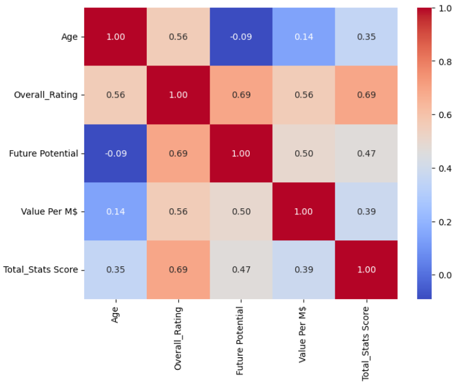

# ⚽ FIFA Player Value and Performance Prediction

A comprehensive Machine Learning project that predicts both **player market value** and **performance level** using a unified scouting system. The project combines regression, classification, hyperparameter optimization, ensemble learning, and cross-validation to build a robust football analytics solution.

---

# 📌 Project Overview

Football clubs rely on data-driven scouting systems to evaluate players before making transfer decisions.

This project develops a **Unified Scouting System** capable of simultaneously predicting:

- 💰 Player Market Value (Regression)
- ⭐ Player Performance Tier (Classification)

The project follows the complete Machine Learning pipeline from data preprocessing to model deployment-ready prediction.

---

# 🚀 Project Features

- Data Cleaning
- Exploratory Data Analysis (EDA)
- Feature Engineering
- Unified Preprocessing Pipeline
- Classification Models
- Regression Models
- Ridge & Lasso Regularization
- Hyperparameter Optimization
- Cross Validation
- Ensemble Learning
- Unified Prediction System

---

# 🛠 Technologies Used

- Python
- Pandas
- NumPy
- Matplotlib
- Scikit-learn
- Jupyter Notebook

---

# 📂 Project Structure

```text
FIFA-Unified-Scouting-System/
│
├── FIFA_Player_Value_and_Performance_Prediction.ipynb
├── fifa.csv
├── README.md
│
├── images/
│   ├── correlation_heatmap.png
│   ├── ridge_best_alpha.png
│   ├── lasso_best_alpha.png
│
├── requirements.txt
├── LICENSE
└── .gitignore
```

---

# 📊 Dataset

The FIFA dataset contains numerical and categorical attributes describing football players.

The project predicts two targets:

### Classification

Performance Tier

- Low
- Mid
- High
- Elite

### Regression

Player Market Value

---

# ⚙️ Data Preprocessing

The preprocessing stage includes:

- Duplicate Removal
- Missing Value Imputation
- Outlier Handling (IQR)
- One-Hot Encoding
- Feature Scaling
- Feature Leakage Removal
- Unified Preprocessing Pipeline

---

# 🤖 Machine Learning Models

## Classification Models

- K-Nearest Neighbors (KNN)
- Support Vector Machine (SVM)
- Random Forest

---

## Regression Models

- KNN Regressor
- Support Vector Regression (SVR)
- Ridge Regression
- Lasso Regression

---

# 🎯 Model Selection

Different machine learning algorithms were selected to capture various learning strategies.

### KNN

Instance-based learning suitable for discovering similarity between players.

### SVM

Kernel-based learning capable of handling non-linear relationships.

### Random Forest

Tree-based ensemble model that captures complex interactions while reducing overfitting.

This diversity enables fair comparison and stronger overall performance.

---

# ⚙️ Hyperparameter Optimization

GridSearchCV was applied to optimize:

- Random Forest
- SVM
- KNN
- SVR

The optimization process improved generalization while reducing overfitting.

---

# 🔄 Cross Validation

5-Fold Cross Validation was used to evaluate:

- Model Stability
- Generalization
- Robustness

Low standard deviation confirmed stable performance across different folds.

---

# 🧩 Ensemble Learning

Two ensemble approaches were implemented.

### Voting

- Voting Classifier
- Voting Regressor

### Stacking

- Stacking Classifier
- Stacking Regressor

Both methods improved predictive stability by combining multiple learners.

---

# ⚽ Unified Scouting System

The final system accepts player statistics and simultaneously predicts:

- Performance Tier
- Estimated Market Value

A unified preprocessing pipeline ensures consistent inference for both prediction tasks.

---

# 📷 Results

## 🔥 Correlation Heatmap

Relationship between player features before modeling.



---

## 📈 Ridge Regression — Best Alpha

The optimal Ridge regularization parameter was selected by minimizing Test RMSE.

**Best Alpha = 0.001**

.png)

---

## 📉 Lasso Regression — Best Alpha

The optimal Lasso alpha was also found at **0.001**, although stronger regularization degraded performance more rapidly.

.png)
---

# 🏆 Key Findings

- Ridge Regression outperformed Lasso Regression across all tested alpha values.
- Hyperparameter optimization reduced overfitting and improved generalization.
- Ensemble learning produced more robust predictions than individual models.
- Cross-validation confirmed the stability of the proposed system.
- The unified scouting system successfully predicts both player value and performance tier.

---

# 🚀 Future Improvements

- XGBoost
- LightGBM
- CatBoost
- Deep Neural Networks
- Explainable AI (SHAP)
- Model Deployment using Streamlit

---

# 📦 Installation

```bash
git clone https://github.com/DoaaAbdelsattar/FIFA-Unified-Scouting-System.git

cd FIFA-Unified-Scouting-System

pip install -r requirements.txt

jupyter notebook FIFA_Player_Value_and_Performance_Prediction.ipynb
```

---

# 👩‍💻 Author

**Doaa Abdelsattar**

GitHub:
https://github.com/DoaaAbdelsattar

---

⭐ If you found this project useful, consider giving it a star.
